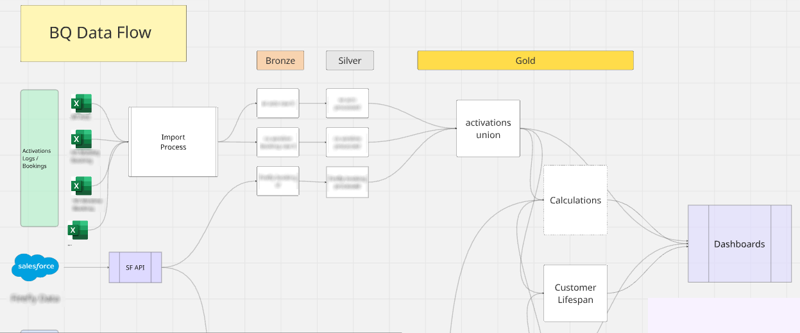
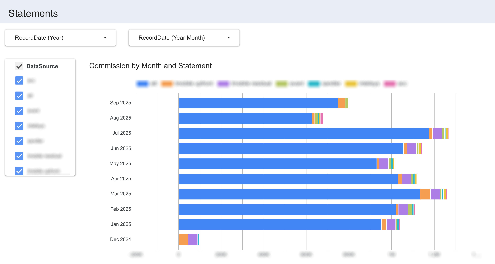

# Company Data Pipeline
**Tech Stack: Google BigQuery - Google Data Studio / "Looker" Studio - SQL - Diagrams**

A remote database and pipeline hosted in the Google Cloud platform.  

This repository describes the project and hosts samples of the content.  No customer, sales, or revenue data are included.

# The Business Problem
My company was a growing business in the wireless activations and services space with multiple business acquisitions - sub-companies I will call "partners."  Each partner had data in multiple categories:
1. Activation logs - or internal records of business done.
1. Incoming commission statements provided by wireless carriers and distributors, often many statements per partner per month.
1. Additional / miscellaneous data, such as activation details with join keys.
1. Supplementary stable data such as commission rates.

Commissions data was wholly unstructured, existing in an array of spreadsheets with different formats.  Most data was provided by spreadsheets, with the rest hosted in separate homegrown portals.  There was no unified database or reporting structure.

I spearheaded and designed the project of a data pipeline in the Google Cloud system: data stored in BigQuery, with data flowing into Data Studio for dashboards.  I lead the data team to complete build on the carrier agency segment, representing 20 data inputs, hundreds of spreadsheets, and hundreds of thousands of records.  On project completion, all data was structured, assembled, and flowing into dashboards.

My **custom ETL system** was critical to the success of this project - a separate project and repository.


# Design Principles

**Medallion Architecture** - The architecture has a tiered structure which preserves raw data at the base layer, and transforms it to usable data at higher levels.

**Immediate Data Flow-Through** - Silver and gold layers were constructed with **SQL views**. Appending raw data in the initial load step created a system where new data is processed and flows immediately dashboards.

**Unified Schema Source** - A table’s schema is defined by a **data key**, a custom spreadsheet that serves as a key for the data.  The creation of the initial table and the processing of subsequent data are all done by the same key, ensuring that all data loaded is consistent with the schema of its destination table.

**OBT Schema Plan** - The project schema was One Big Table / OBT across the board.  Most data was carrier statement data provided by an external source.  Having a valid bronze layer required the preservation of the data in its original state as closely as possible.  The data also exhibited a low level of redundancy, so there would be almost no gain in efficiency by abstracting it into dimensions.  A few dimensions were used for enhancing the data or supporting calculations.

**Accessible Auxiliary Tables for Direct SME Maintenance** - The database relies on auxiliary information.  There are effectively a few dimensions that enhanced the core data.  These dimensions are:
* Supplemental company information linked to IDs seller commission rates. 
* Current sales agents with their commission rate multipliers.
* Product types relating to listed products.

For this information, we utilized Google Sheets as external tables.  Google Sheets enabled SMEs to access and update that data directly in a readable, user-friendly format.  These updates would immediately flow into the system and be reflected in end results.

# Pipeline Architecture
The database has a medallion architecture, creating one axis of structure.  The input source type formed a second axis.  We had multiple data groups to incorporate:
1. Activation logs
1. Carrier statements
1. Miscellaneous (carrier) data

These data groups represented the final unions that the pipeline should produce.

I designed a data flow plan represents both major axes: the medallion architecture, and the data group.  In the diagram, swim lanes represent data groups,   such as Activations.  Vertical regions represent medallion layers, such as Bronze.

*Slice of the Data Flow Plan*


## Layer Definitions
### Bronze
Raw inputs.  Each data source is loaded into the BigQuery system with this base layer matching original spreadsheets as closely as possible.  However, some preprocessing was necessary for loading.
* **Data cleaning,** particularly removing problematic delimiter symbols from text.
* **Datatype enforcement,** according to the preset table schema.
* **Supplementing data** as necessary.  All data are supplemented with an `UploadDate` column.  Some data needed an arbitrary index or arbitrary partner ID / "SPID" loaded.

With the exception of a few additional columns and cleaned symbols, the data in the bronze layer matches the data in the spreadsheet sources exactly.

Data is loaded to long-term raw tables with **merged-inserts.**  

*Example merged-insert query for load into long-term Bronze-layer table*
```sql
MERGE `netspark-database.raw_input.tmobile_upfront_raw` T
USING `netspark-database.load.tmobile_upfront_load` S
ON T.CheckNumber = S.CheckNumber
    AND T.ActivityType = S.ActivityType
    AND T.ServiceUniversalID = S.ServiceUniversalID

WHEN NOT MATCHED THEN
INSERT (Month, CheckNumber, CustomerName, BAN, ActDate, DeactDate, ReactDate, ProductType, ActivityType, ServiceUniversalID, DealerCode, DealerName, Coop, Spiff, Commission, Deposit, MonthlyAccess, PlanCode, MarketCode, ...)

VALUES (S.Month, S.CheckNumber, S.CustomerName, S.BAN, S.ActDate, S.DeactDate, S.ReactDate, S.ProductType, S.ActivityType, S.ServiceUniversalID, S.DealerCode, S.DealerName, S.Coop, S.Spiff, S.Commission, S.Deposit, S.MonthlyAccess, S.PlanCode, S.MarketCode, ...);
```

### Silver
Processed inputs.  Unnecessary columns are sliced out.  Data is organized to a standard format as defined by column standards – but maintain all columns that have utility for that source.  

*Example processing query for silver layer:*
```sql
-- Process T-Mobile Data
-- CTE for prep
WITH tmo1 AS (
SELECT *,
  GREATEST(MonthlyAccess, OriginalTotalMRC) AS MRC,
  Spiff+Commission AS Comp,
FROM `raw_input.tmobile_upfront_raw`)

-- Query
SELECT  
    -- [columns omitted] --

    -- Commission
    CASE 
      WHEN Comp > 0 THEN 1
      WHEN Comp < 0 THEN -1
      ELSE 0
      END AS Qty,
    MRC,
    Comp AS Commission,
    ROUND(SAFE_DIVIDE(Comp,MRC), 1) AS EffectiveRate, 

    -- Data Tags
    'tmobile_upfront' AS DataSource,
    UploadDate,

FROM tmo1
-- Filtering $0 lines from Silver.
WHERE Comp <> 0
```

### Gold
The Gold Layer represents unions and calculations.  All sales trackers are combined into one view object, as are all statements.  Unions can flow to dashboards directly, or go through additional processing.  Planned calculation layers would eventually process this information into customer contract terms and expected business lifespans.

### Dashboards
The data flows from Google BigQuery to Looker Studio.  Dashboards provide complete information to executives.  One dashboard set describes all activations, sliceable by partner, customer, activation month, and any other major category.  The commissions / statement dashboards show all commission revenue received, broken out by the same dimensions.  Finally, long-run dashboards show expected revenue vs actual received over time, both giving a picture of revenue development, and signaling when there may be a disconnect between expectations and revenue received.

*Commission Statements Overview Dashboard - Sliced and Blurred*



# Summary
My data pipeline project assembled and unified data across a disparate, growing company with multiple components: multiple partners, sales agents, product types, revenue types, and more. The medallion architecture made data available in all useful forms, and preserved the original for auditing and validation.  The view structure caused data to flow throughout the pipeline once loaded into the Bronze Layer without additional upkeep.  This data pipeline enabled my company to report activations and revenues to executives in a clean, powerful, stable, and unified way.  And it enables more development in the future, such as centralizing dispute processing and even the development of predictive models powered by machine learning.
